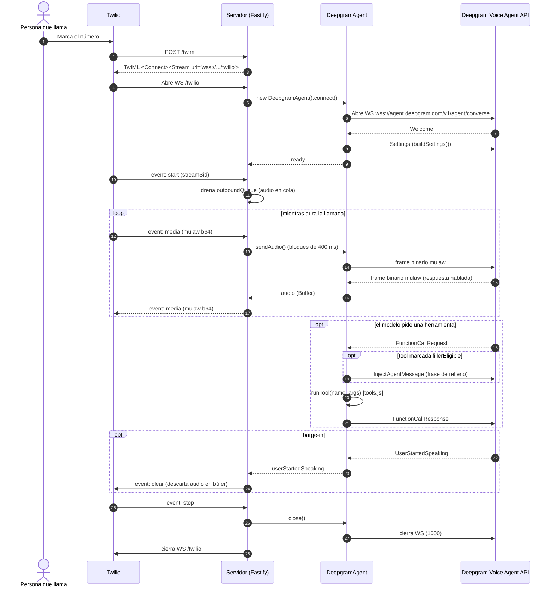
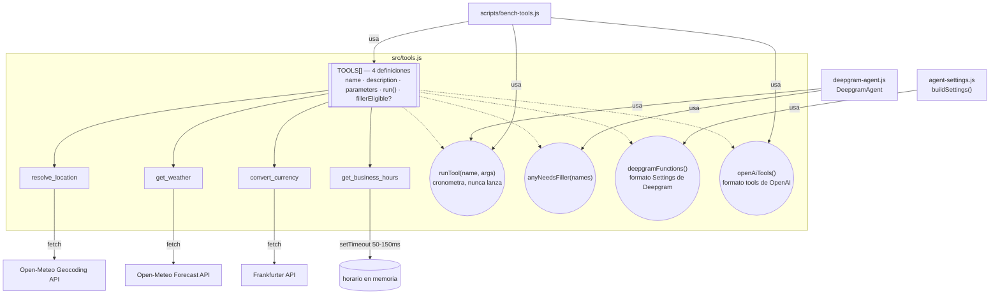
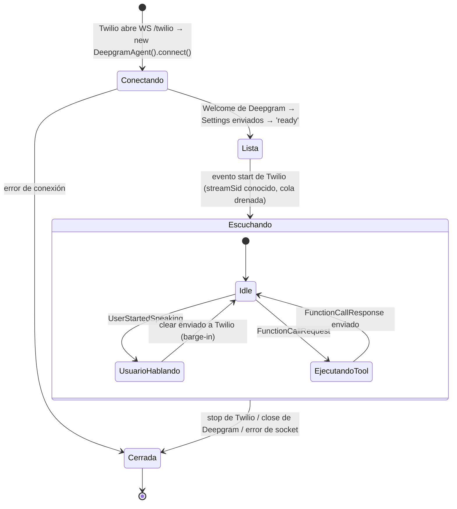

# Cómo funciona

Diagramas de referencia para quien vaya a tocar el código: el flujo de una llamada de
principio a fin, la arquitectura de las herramientas del agente, y los estados por los que
pasa una sesión. Para la vista general del proyecto, ver el [README](README.md).

## Flujo de una llamada

Notas sobre el diagrama:

- El audio se reenvía tal cual entre Twilio y Deepgram: ambos hablan mulaw a 8 kHz, así que
  solo cambia el envoltorio (base64 dentro de JSON en el lado Twilio, frames binarios en el
  lado Deepgram). Ver [twilio-stream.js](src/routes/twilio-stream.js).
- El audio entrante se agrupa en bloques de 400 ms antes de mandarlo a Deepgram
  (`config.audio.chunkBytes`), para no hacer una escritura de socket cada 20 ms.
- El relleno hablado (`InjectAgentMessage`) solo se envía para tools marcadas
  `fillerEligible: true` en [tools.js](src/tools.js) — ver la sección
  ["Tool calling"](README.md#tool-calling) del README.
- El barge-in (`UserStartedSpeaking` → `clear`) descarta el audio que Twilio tenga en su
  búfer de reproducción, para que la persona pueda interrumpir al agente hablándole encima.
- El audio se pone en cola mientras la sesión de Deepgram se negocia (`Welcome` → `Settings`),
  y lo mismo al revés si el saludo del agente llega antes que el evento `start` de Twilio (no
  se conoce el `streamSid` todavía). Así no se pierden los primeros milisegundos de la llamada.

## Arquitectura de src/tools.js

`tools.js` es el único punto de contacto entre el agente y el mundo exterior. Expone cuatro
funciones sobre el mismo array `TOOLS`:

- `deepgramFunctions()` — formatea las definiciones para el mensaje `Settings` que arma
  [agent-settings.js](src/agent-settings.js).
- `runTool(name, args)` — ejecuta una herramienta y cronometra cuánto tarda; nunca lanza, así
  un fallo de la API externa se devuelve como resultado para que el modelo se lo explique a
  quien llama en vez de cortar la llamada.
- `anyNeedsFiller(names)` — decide si toca mandar una frase de relleno antes de ejecutar
  (usado por [deepgram-agent.js](src/deepgram-agent.js)).
- `openAiTools()` — la misma lista en formato de tools de OpenAI, para que
  [bench-tools.js](scripts/bench-tools.js) pueda comparar modelos llamando al LLM
  directamente, sin pasar por una llamada de voz real.

## Estados de una sesión

`UsuarioHablando` es una simplificación: Deepgram manda `UserStartedSpeaking` cuando detecta
que la persona empezó a hablar encima del agente, pero no hay un evento equivalente de "dejó
de hablar" — la sesión vuelve a `Idle` sin una transición explícita en el código. En el
diagrama es más una anotación de intención que un estado 1:1 con lo que hace
[deepgram-agent.js](src/deepgram-agent.js).
